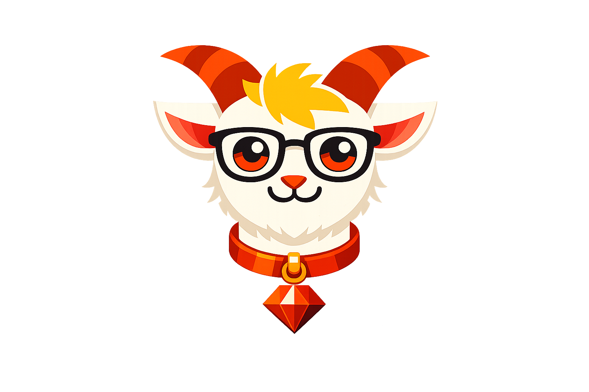

# Klaus

<p align="center">
  
</p>

[](https://github.com/dingsdax/klaus/actions/workflows/ci.yml)
[](https://badge.fury.io/rb/Klaus)
[](https://opensource.org/licenses/MIT)

An embeddable, ISO-aspirational :) Prolog interpreter in pure Ruby.

Klaus lets you define logical rules as data and query them at runtime. No external binaries, no FFI, no DSLs, just strings in, answers out.

## Use Cases

The key advantage of an embeddable Prolog is that **rules live in data, not code**. You can store them in a database, load them from a config file, let non-developers edit them, and hot-reload without re-deploying.

- **Authorization & access control**: Define roles, permissions, and inheritance as Prolog rules. Query `can_access(User, Resource)` instead of writing nested if/else chains. Rules are auditable by non-engineers.
- **Configuration validation**: Express constraints as rules ("service A depends on service B"), feed your config as facts, query for violations.
- **Expert systems**: Decision trees for medical triage, insurance underwriting, tax eligibility, support routing. The knowledge base is human-readable and modifiable without code deploys.
- **Data lineage & dependency graphs**: Express "table A derives from table B" as facts, "transitive dependency" as a rule. Query reachability, find cycles.
- **Education**: Teach logic programming from a familiar Ruby environment without requiring a separate Prolog installation.
- **Game AI**: NPC behavior rules, dialogue trees, puzzle solvers. Prolog's backtracking naturally explores possibilities.

## Installation

Add to your Gemfile:

```ruby
gem 'Klaus'
```

Or install directly:

```
gem install Klaus
```

## Quick Start

```ruby
require 'klaus'

# Define a knowledge base
kb = Klaus.parse_knowledge_base(<<~PROLOG)
  parent(john, bob).
  parent(john, lisa).
  parent(bob, ann).
  parent(bob, carl).

  grandparent(X, Z) :- parent(X, Y), parent(Y, Z).
PROLOG

# Query for direct relationships
query = Klaus.parse_query('parent(john, X)')
solutions = Klaus.solve(kb, query)
# => [{X: Atom("bob")}, {X: Atom("lisa")}]

# Query with rule resolution
query = Klaus.parse_query('grandparent(john, Z)')
solutions = Klaus.solve(kb, query)
# => [{Z: Atom("ann")}, {Z: Atom("carl")}]
```

## API

| Method | Description |
|--------|-------------|
| `Klaus.parse_knowledge_base(string)` | Parse a Prolog program (facts and rules) into its internal representation |
| `Klaus.parse_query(string)` | Parse a Prolog query into its internal representation |
| `Klaus.solve(knowledge_base, goals)` | Execute a query against a knowledge base, returns an array of solution environments |

## Architecture

Klaus processes Prolog in a five-stage pipeline:

**Source string** &rarr; **Parser** (Parslet) &rarr; **Transformer** &rarr; **Domain objects** (Atom, Variable, Compound, Rule) &rarr; **SLD Resolution** (Unifier) &rarr; **Solution environments**

See [AGENTS.md](AGENTS.md) for details.

## Current Limitations

The following ISO Prolog features are not yet implemented:

- Arithmetic (`is/2`, comparison operators)
- Lists (`[H|T]` syntax)
- Cut (`!`) and negation-as-failure (`\+`)
- Control constructs (`->`, `;`)
- Built-in predicates (`var/1`, `atom/1`, `findall/3`, etc.)
- I/O streams
- Exception handling (`catch/3`, `throw/1`)
- Occurs check (omitted intentionally, matching SWI-Prolog's default behavior)

## Related Projects

- [ruby-prolog](https://github.com/preston/ruby-prolog) — Prolog-like DSL for Ruby with inline logic programming. Actively maintained, used in production for access control and layout engines.
- [porolog](https://github.com/wizardofosmium/porolog) — Prolog using plain old Ruby objects, designed to embed logic queries in regular Ruby programs.
- [upl](https://github.com/djellemah/upl) — FFI bridge to SWI-Prolog. Different approach: wraps a full Prolog runtime rather than reimplementing in Ruby.

Klaus differs by parsing standard Prolog syntax (not a Ruby DSL) and aiming for ISO compliance.

## Contributing

See [CONTRIBUTING.md](CONTRIBUTING.md) for guidelines.

## Why "Klaus"?

Prolog is based on [Horn clauses](https://en.wikipedia.org/wiki/Horn_clause). Say "clauses" with a German accent and you get... Klaus. Naturally, he's a mountain goat — the only animal whose horns double as logical inference rules. The glasses are for reading specs. The Ruby pendant is self-explanatory.

## License

[MIT](LICENSE)
